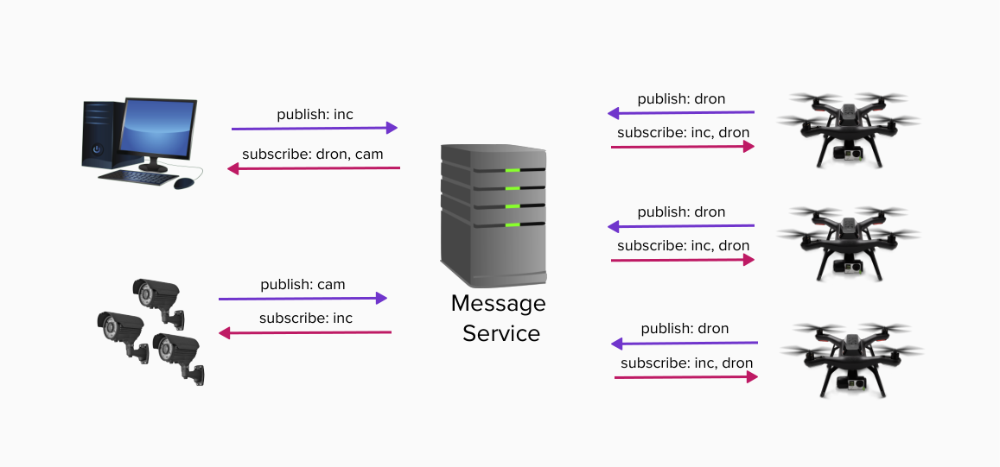
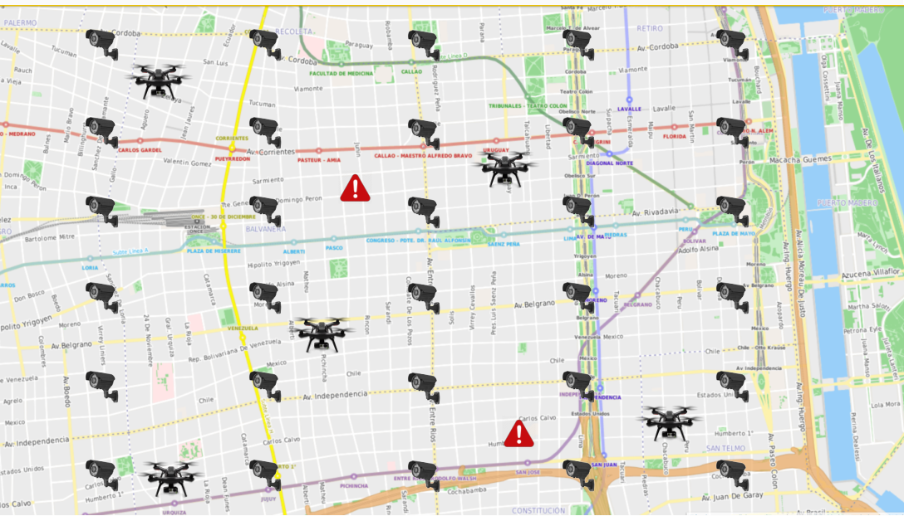

# Proyecto: Agentes Autónomos de Prevención

## Introducción
El gobierno de la Ciudad de Buenos Aires desea implementar un sistema de vigilancia en la vía publica incorporando a sur red de monitoreo una flota de drones autónomos para realizar tareas de prevención de incidentes.
Para lo cual se deberá construir una red de mensajería asincrónica, respetando alguno de los protocolos existentes de *message broking* como por ejemplo: MQTT, AMQP, entre otros.

## Objetivo del Proyecto
El proyecto comienza con una investigación inicial respecto de los protocolos en cuestión y un análisis de ventajas y desventajas de cada uno de ellos, seguido de lo cual su equipo tomara la decisión de cual protocolo implementar. Este análisis deberá estar documentado y formara parte del informe del trabajo practico, incluyendo una introducción a los sistemas de mensajería asincrónica y  ‘message brokers’ una comparativa de los protocolos relevados y la justificación de las razones para la elección del protocolo a implementar.

Una vez completada esta instancia de investigación se procederá al relevamiento de la necesidades de negocio de la aplicación a implementar, el cual no solo deberá incluir todos los puntos listados en la sección Requerimientos Funcionales de la aplicación de este presente enunciado sino también todo requerimiento que surja de su análisis y de las conversaciones y definiciones que se tomen durante el seguimiento del proyecto por parte de su equipo docente evaluador.

 
## Servicio de mensajería
Independientemente del protocolo elegido se recomienda seguir el patrón de comunicación *publisher-suscriber* y la arquitectura *cliente-servidor*. 
Para lo cual se deberá implementar por un lado el servidor de mensajería y por otro lado una library que permitirá la comunicación por parte de los clientes.
Se deberá tener en cuenta los siguientes requerimientos:
* Seguridad: autenticación, autorización, encriptación, etc.
* Calidad de servicio (Quality of Service, QoS): como mínimo se debe soportar '*at least one*'
* Reliability: el servidor deberá tener registro de los clientes conectados y permitir a un cliente que sufra una desconexión poder reconectarse y obtener los mensajes que no recibió (sesiones y almacenamiento de mensajes) 
* Configuración: debe incluir todos los parámetros necesarios para la ejecución del servidor, como el puerto, direccion IP, etc. (no esta permitido definir estos valores mediante constantes en el código)
* Logging: debe registrar un resumen de los mensajes recibidos y enviados, y cualquier error o evento significativo durante la ejecucion del servidor.

A continuacion se observa un diagrama de comunicacion entre las aplicaciones involucradas:

## Requerimientos funcionales
Se deben implementar al menos 3 aplicaciones: 
1. Aplicación de monitoreo: debe poder recibir la carga de incidentes por parte del usuario y notificar a la red ante la aparición de un incidente nuevo y los cambios de estado del mismo (iniciado, resuelto, etc). En la misma se podrá visualizar el estado completo del sistema incluyendo el mapa geográfico de la región con los incidentes activos y la posición y el estado de cada agente (*dron*) y cada cámara de vigilancia.

2. Sistema central de cámaras: el mismo tendrá la ubicación y el estado de cada cámara y permitirá agregar, quitar y modificar las mismas. El estado de cada cámara deberá ser dinámico y adaptarse a las circunstancias, es decir, cuando no haya ningún incidente cercano las cámaras permanecerán en modo de ahorro de energía, al registrarse un incidente en la zona deberán pasar a modo activo, etc.

3. Software de control del agente (*dron*): cada dispositivo independiente ejecutará una instancia de esta aplicación la cual se conectara a la red para recibir la información de incidentes cercanos a la zona de alcance del *dron*. Ademas deberá mantener la posición geográfica del dispositivo y su estado (en espera, atendiendo un incidente, etc) y en caso que corresponda la dirección y velocidad de movimiento. El dispositivo tendrá ciertos parámetros de funcionamiento, como por ejemplo la distancia máxima de alcance, duración de batería, etc. Todos estos parámetros deberán ser definidos en un archivo de configuración.

### Reglas de negocio
1.  Los incidentes se crean ingresando su posicion geográfica a traves de la aplicación de monitoreo.
2.  Un incidente se resuelve cuando al menos dos agentes (*drones*) llegan al lugar del incidente y transcurre un tiempo definido por configuración en esa posición.
3.  Los agentes que reciben la notificación de un incidente deben movilizarse hacia ese incidente solo si:
    a. El incidente se produjo dentro del area máxima de alcance del agente (*dron*)
    b. No se reciben notificaciones de dos agentes mas cercanos que ya esten atendiendo el incidente.
    c. El nivel de bateria del *dron* se encuentra sobre los valores mínimos de operacion (definido en el archivo de configuración).
4.  Los agentes tienen un area de operacion asignada por configuración y deben notificar su posición y estado frecuentemente.
5.  Luego de atender un incidente el agente debe volver a su area de operación asignada.
6.  El nivel de bateria de cada agente se debera ir descargando con el paso del tiempo (se simulara su descarga).
7.  Cuando un agente se encuentra con niveles de bateria mínimos debe regresar a la central para su mantenimiento, es decir recuperará la bateria a niveles máximos, para luego volver a su area de operación asignada.
8.  Las cámaras inician su funcionamiento en modo ahorro de energia y deben pasar a estado de alerta cuando se recibe una notificación de un incidente en su area de alcance o en la de una cámara lindante (un nivel de proximidad en cada sentido de orientacion).

### Interfaz gráfica
La aplicación de monitoreo debe presentar una interfaz gráfica que permita la visualizacion del estado completo del sistema incluyendo el mapa geográfico de la región con los incidentes activos y la posición y el estado de cada agente (*dron*) y cada cámara de vigilancia.
Ademas permitira el ingreso por parte del usuario de nuevos incidentes y la modificacion manual de los mismos si hiciera falta.
*Opcional: La aplicacion puede permitir el envio de notificaciones a los agentes para realizar determinadas acciones como por ejemplo regresar a la central.*
A continuacion se muestra un ejemplo de la visualizacion del mapa geografico a modo de referencia:

## Requerimientos no funcionales
Los siguientes son los requerimientos no funcionales para la resolución del proyecto:

* El proyecto deberá ser desarrollado en lenguaje Rust, utilizando las herramientas de la biblioteca estándar.
* Se deben implementar pruebas unitarias y de integración de las funcionalidades que se consideren más importantes.
* El código fuente debe compilar en la versión estable del compilador y no se permite el uso de bloques inseguros (unsafe).
* El código deberá funcionar en ambiente Unix / Linux.
* La compilación no debe generar advertencias del compilador ni del linter clippy.
* Las funciones y los tipos de datos (struct) deben estar documentados siguiendo el estándar de cargo doc.
* El código debe formatearse utilizando cargo fmt.
* Las funciones no deben tener una extensión mayor a 30 líneas. Si se requiere una extensión mayor, se debe particionar en varias funciones.
* Cada tipo de dato implementado debe ser colocado en una unidad de compilación (archivo fuente) independiente.

## Crates externos permitidos
Se permite el uso de los siguientes crates solo para los usos mencionados (siempre y cuando se los considere necesario):

* rand: para la generación de valores aleatorios.
* chrono: para la obtención del timestamp actual.

**Nota:** para la implementación de la interfaz gráfica se podrá proponer crates que deseen utilizar, los cuales serán evaluados y autorizados por el grupo docente. 

## Criterios de Aceptación y Corrección del Proyecto
Para el desarrollo del proyecto, se deberá observar los siguientes lineamientos generales:
1. **Testing:** Se deberá implementar testing unitario automatizado, utilizando las herramientas de Rust de los métodos y funciones relevantes implementados. Se deberán implementar tests de integración automatizados.
2. **Manejo de Errores:** Deberá hacerse un buen uso y administración de los casos de error, utilizando para ello, las estructuras y herramientas del lenguaje, escribiendo en forma lo más idiomática posible su tratamiento.
3. **Control de versiones:** Se deberá utilizar la herramienta git, siguiendo las recomendaciones de la cátedra. En particular, se deberá utilizar la metodología GitHub Flow para el trabajo con ramas (branches) y la entrega continua del software.
4. **Trabajo en equipo:** Se deberá adecuar, organizar y coordinar el trabajo al equipo, realizando tareas como revisión de código cruzada entre pares de una funcionalidad en un pull request de git.
5. **Merge de Branchs:** Para poder hacer el merge de un branch de una funcionalidad, todos los tests pasan de forma satisfactoria
6. **Informe final:** El trabajo debe acompañarse por un informe que debe incluir diagramas de secuencia de las operaciones más relevantes, diagrama de componentes y módulos de la arquitectura general del diseño desarrollado, todos acompañados de la explicación respectiva.

## Evaluación
El desarrollo del proyecto tendrá un seguimiento directo semanal por parte del docente a cargo del grupo.

Se deberá desarrollar y presentar los avances y progreso del trabajo semana a semana (simulando un sprint de trabajo). Cada semana, cada docente realizará una valoración del estado del trabajo del grupo.

El progreso de cada semana deberá ser acorde a lo que se convenga con el docente para cada sprint. Si el mismo NO cumple con la cantidad de trabajo requerido, el grupo podrá estar desaprobado de forma prematura de la materia, a consideración del docente.

Hacia la mitad del desarrollo del proyecto se deberá entregar una versión preliminar que deberá cumplir con los requisitos mencionados en el apartado *Entrega intermedia* anteriormente enunciado. Estos requisitos **son de cumplimiento mínimo y obligatorio**, aquellos grupos que lo deseen podrán implementar requisitos adicionales.

**Nota importante:** Se deja constancia que las funcionalidades requeridas por este enunciado son un marco de cumplimiento mínimo y que pueden haber agregados o modificaciones durante el transcurso del desarrollo por parte del docente a cargo, que formarán parte de los requerimientos a cumplir. Cabe mencionar que estos desvíos de los requerimientos iniciales se presentan en situaciones reales de trabajo con clientes.

## Finalización del Proyecto
El desarrollo del proyecto finaliza el último día de clases del cuatrimestre. En esa fecha, cada grupo deberá realizar una presentación final y se hará una evaluación global del trabajo.

En dicha presentación se deberá detallar la arquitectura del proyecto, aprendizajes del mismo, y realizar una muestra funcional del desarrollo, esto es una "demo" como si fuera para el usuario final.

El trabajo debe acompañarse por un informe que debe constar de los puntos detallados a continuación, diagramas de secuencia de las operaciones más relevantes, diagrama de componentes y módulos de la arquitectura general del diseño desarrollado, todos acompañados de la explicación respectiva.

## Informe
[TBD]

## Entrega Intermedia
[TBD]

## Fechas de entrega:

Entrega intermedia: (a definir)
Entrega final de la cursada:  (a definir)
**Estas entregas serán presenciales en la sede de la Facultad.**

