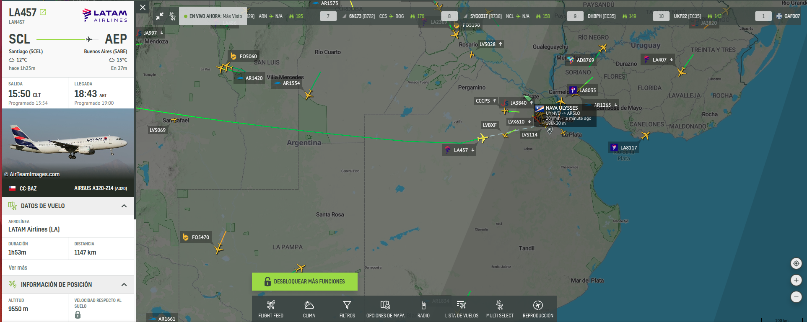

# Proyecto: Aerolíneas Rusticas - 2C 2024

## Introducción
Aerolíneas Rusticas les solicita implementar un sistema de control de vuelos global, debido a que necesita controlar los vuelos tanto nacionales, como internacionales, teniendo base en varios países. Para lograr este objetivo se desea implementar una base de datos distribuida que sea escalable y posea tolerancia a fallos.

## Objetivo del Proyecto
El objetivo principal de este proyecto es la implementación de un sistema de gestión de datos de vuelos de aeropuertos utilizando una base de datos distribuida compatible con Cassandra. Se deberá diseñar e implementar una base de datos distribuida que permita el almacenamiento y recuperación eficiente de datos distribuidos en múltiples nodos y soporte tolerancia a fallos ante la caída de uno o mas nodos de la red.

El objetivo secundario es desarrollar un proyecto real de software de mediana envergadura aplicando buenas prácticas de desarrollo, incluyendo entregas y revisiones periódicas.

El proyecto comienza con una investigación sobre como funcionan las bases de datos distribuidas, en particular el motor de base de datos Cassandra. Incluyendo conceptos como Consistent Hashing, Replication Factor, Consistency Level, Read Repair, entre otros, así como también el diseño y modelado de bases de datos distribuidas. 

## Requerimientos Funcionales

### Aplicación de Vuelos
Se debe construir una aplicación con interfaz grafica (UI) que despliegue un mapa geográfico mundial y permita mostrar datos de vuelos (arribos y partidas) seleccionando un aeropuerto del mapa. Dentro de los datos a visualizar existen dos grupos de información bastante diferenciados: por un lado la información del *Estado de los vuelos*, la cual deberá tener un nivel de consistencia fuerte (**strong consistency**) y por otro lado los datos de *Seguimiento de vuelos* en curso, que incluyen valores de *tracking* de los vuelos en tiempo real, como la velocidad, ubicación actual (latitud y longitud), nivel de combustible, entre otros, para estos valores se utilizara un nivel de consistencia débil (**weak consistency**).
Se deberá tener en cuenta los patrones de acceso a esta información por fecha y aeropuerto de origen o destino de manera de poder crear las particiones adecuadas para estos tipos de acceso (origen y fecha / destino y fecha).
Dicha interfaz deberá permitir editar el *Estado de los vuelos* (**strong consistency**), ya sea para agregar nuevos vuelos o modificar vuelos existentes, por ejemplo para modificar un vuelo *on-time* a *delayed*.

### Servidor de Base de Datos
Para dar soporte a esta aplicación se debe construir un motor de base de datos distribuidas **Cassandra-compatible**, es decir que soporte tanto el lenguaje de consultas CQL ([Cassandra Query Language](https://cassandra.apache.org/doc/latest/cassandra/developing/cql/index.html)), como también el [protocolo de comunicación nativo](https://cassandra.apache.org/_/native_protocol.html) de Cassandra. 
El *cluster* a utilizar deberá contener entre 5 y 8 nodos y estos nodos se comunicaran entre si utilizando el protocolo [Gossip](https://www.youtube.com/watch?v=vEk3VDC0J7k) para mantener la informacion de estado de cada nodo.
Se deberán tener en cuenta conceptos como [Consistent Hashing](https://cassandra.apache.org/doc/latest/cassandra/architecture/dynamo.html#dataset-partitioning-consistent-hashing), Replication Factor, Consistency Level, [Read-Repair](https://cassandra.apache.org/doc/stable/cassandra/operating/read_repair.html), etc.

Dentro de las funcionalidades del motor de base de datos se deberán contemplar los siguientes puntos:

1. **Modelado de Datos:**
   - Diseño del esquema de la base de datos, incluyendo keyspaces y tablas.
   - Definición de particiones y clustering de columnas para optimizar el rendimiento.

2. **Operaciones CRUD:**
   - Operaciones de creación, lectura, actualización y eliminación utilizando CQL (Cassandra Query Language).
   - Implementación de [Read-Repair](https://www.youtube.com/watch?v=lNIrj9VuBQ0)

3. **Replicación y Consistencia:**
   - Configuración de estrategias de replicación ([Replication Factor](https://www.youtube.com/watch?v=sns5nc3IU5g)).
   - Soporte a distintos niveles de consistencia ([Consistency Level](https://www.youtube.com/watch?v=Gx-pmH-b5mI)).

4. **Funcionamiento de Clúster:**
   - Soporte al [protocolo de comunicacion nativo](https://cassandra.apache.org/_/native_protocol.html) de Cassandra.
   - Implementación del protocolo [Gossip](https://www.youtube.com/watch?v=vEk3VDC0J7k) para comunicación entre nodos.
   - Tolerancia a fallo de uno o mas nodos del cluster. 
   - *Punto Bonus* (opcional): demostrar la compatibilidad utilizando un cliente comercial de Cassandra.

5. **Seguridad:**
   - Autenticación y autorización.
   - Encriptación de datos en tránsito (in-transit).
   - Opcional: Encriptación de datos en reposo (at-rest).

### Simulador de Vuelos
Se deberá desarrollar una aplicación de consola encargada de simular el comportamiento de los vuelos. Dicha aplicación permitirá introducir un vuelo, indicando el número de vuelo, origen, destino y velocidad estimada promedio y simulará el comportamiento de ese vuelo generando datos de tracking del vuelo, como la posición en latitud y longitud, altitud, nivel de combustible, velocidad actual, entre otros, esta información se guardara como datos de *Seguimiento de vuelos* en curso (**weak consistency**).
Esta aplicación deberá contemplar alguna estrategia de multithreading para soportar la simulación de múltiples vuelos al mismo tiempo, como por ejemplo mediante el uso de [ThreadPool](https://doc.rust-lang.org/book/ch20-02-multithreaded.html#improving-throughput-with-a-thread-pool).

## Requerimientos no funcionales
Los siguientes son los requerimientos no funcionales para la resolución del proyecto:

* El proyecto deberá ser desarrollado en lenguaje Rust, utilizando las herramientas de la biblioteca estándar.
* Se deben implementar pruebas unitarias y de integración de las funcionalidades que se consideren más importantes.
* El código fuente debe compilar en la versión estable del compilador y no se permite el uso de bloques inseguros (unsafe).
* El código deberá funcionar en ambiente Unix / Linux.
* La compilación no debe generar advertencias del compilador ni del linter clippy.
* El programa no puede contener ningún [Busy-Wait](https://en.wikipedia.org/wiki/Busy_waiting), ni puede consumir recursos de CPU y/o memoria indiscriminadamente. Se debe hacer un uso adecuado tanto de la memoria como del CPU. 
* Las funciones y los tipos de datos (struct) deben estar documentados siguiendo el estándar de cargo doc.
* El código debe formatearse utilizando cargo fmt.
* Las funciones no deben tener una extensión mayor a 30 líneas. Si se requiere una extensión mayor, se debe particionar en varias funciones.
* Cada tipo de dato implementado debe ser colocado en una unidad de compilación (archivo fuente) independiente.

## Crates externos permitidos
Se permite el uso de los siguientes crates solo para los usos mencionados (siempre y cuando se los considere necesario):

* rand: para la generación de valores aleatorios.
* chrono: para la obtención del timestamp actual.

**Nota:** para la implementación de la interfaz gráfica se podrá proponer crates que deseen utilizar, los cuales serán evaluados y autorizados por el grupo docente. 

## Material de Consulta
- [Documentación de Apache Cassandra](https://cassandra.apache.org/doc/latest/)
- [Cassandra Query Language (CQL)](https://cassandra.apache.org/doc/latest/cql/)
- [Gossip Protocol](https://www.kth.se/social/upload/51647982f276546170461c46/4-gossip.pdf)
- [Curso: Foundations of Apache Cassandra](https://www.youtube.com/watch?v=69pvhO6mK_o&list=PL2g2h-wyI4Spf5rzSmesewHpXYVnyQ2TS)

## Criterios de Aceptación y Corrección del Proyecto
Para el desarrollo del proyecto, se deberá observar los siguientes lineamientos generales:
1. **Testing:** Se deberá implementar testing unitario automatizado, utilizando las herramientas de Rust de los métodos y funciones relevantes implementados. Se deberán implementar tests de integración automatizados.
2. **Manejo de Errores:** Deberá hacerse un buen uso y administración de los casos de error, utilizando para ello, las estructuras y herramientas del lenguaje, escribiendo en forma lo más idiomática posible su tratamiento.
3. **Control de versiones:** Se deberá utilizar la herramienta git, siguiendo las recomendaciones de la cátedra. En particular, se deberá utilizar la metodología GitHub Flow para el trabajo con ramas (branches) y la entrega continua del software.
4. **Trabajo en equipo:** Se deberá adecuar, organizar y coordinar el trabajo al equipo, realizando tareas como revisión de código cruzada entre pares de una funcionalidad en un pull request de git.
5. **Merge de Branchs:** Para poder hacer el merge de un branch de una funcionalidad, todos los tests pasan de forma satisfactoria
6. **Informe final:** El trabajo debe acompañarse por un informe que debe incluir diagramas de secuencia de las operaciones más relevantes, diagrama de componentes y módulos de la arquitectura general del diseño desarrollado, todos acompañados de la explicación respectiva.

## Evaluación
El desarrollo del proyecto tendrá un seguimiento directo semanal por parte del docente a cargo del grupo.

Se deberá desarrollar y presentar los avances y progreso del trabajo semana a semana (simulando un sprint de trabajo). Cada semana, cada docente realizará una valoración del estado del trabajo del grupo.

El progreso de cada semana deberá ser acorde a lo que se convenga con el docente para cada sprint. Si el mismo NO cumple con la cantidad de trabajo requerido, el grupo podrá estar desaprobado de forma prematura de la materia, a consideración del docente.

Hacia la mitad del desarrollo del proyecto se deberá entregar una versión preliminar que deberá cumplir con los requisitos mencionados en el apartado *Entrega intermedia*. Estos requisitos **son de cumplimiento mínimo y obligatorio**, aquellos grupos que lo deseen podrán implementar requisitos adicionales.

**Nota importante:** Se deja constancia que las funcionalidades requeridas por este enunciado son un marco de cumplimiento mínimo y que pueden haber agregados o modificaciones durante el transcurso del desarrollo por parte del docente a cargo, que formarán parte de los requerimientos a cumplir. Cabe mencionar que estos desvíos de los requerimientos iniciales se presentan en situaciones reales de trabajo con clientes.

## Finalización del Proyecto
El desarrollo del proyecto finaliza el último día de clases del cuatrimestre. En esa fecha, cada grupo deberá realizar una presentación final y se hará una evaluación global del trabajo.

En dicha presentación se deberá detallar la arquitectura del proyecto, aprendizajes del mismo, y realizar una muestra funcional del desarrollo, esto es una "demo" como si fuera para el usuario final, donde se pueda observar todas las funcionalidades pedidas por el presente enunciado. 

Durante la demostración en vivo, se debe poder observar tanto los requerimientos funcionales solicitados en el presente enunciado, como así también los requerimientos no funcionales, es decir, se debe poder observar y comprobar todo lo relacionado a temas como Replication Factor, Consistency Level, Read-Repair, Tolerancia a fallos, entre otros. 
Por ejemplo: se debe producir un escenario de falla de alguno de los nodos (desconectando el nodo o cerrando la aplicación) y demostrar que la aplicación continua funcionando correctamente incluso al solicitar datos almacenados en dicho nodo.

El trabajo debe acompañarse por un informe que debe constar de los puntos detallados a continuación: explicación general de la investigación realizada y sus conclusiones, reglas de negocio de la solución y decisiones tomadas durante el desarrollo del proyecto, diagramas de secuencia de las operaciones más relevantes, diagrama de componentes y módulos de la arquitectura general del diseño desarrollado, todos acompañados de la explicación respectiva.

### Entrega Intermedia:
Los alumnos deberán realizar una entrega intermedia, la cual deberá incluir los siguientes puntos:

1. **Modelado y Diseño de Datos:**
   - Creación de keyspaces y tablas.
   - Definición de particiones y clustering keys.
2. **Operaciones Básicas:**
   - Inserción de datos en las tablas.
   - Consultas básicas de datos.
   - Actualización y eliminación de registros (opcional).
3. **Replicación Básica:**
   - Estrategias de replicación simple.
   - Replicacion de datos en mas de un nodo según el valor de Replication Factor.
4. **Documentación:**
   - Documentación del diseño del esquema de tablas y las decisiones de particionamiento.
   - Diagramas de explicación de la solución implementada.
5. **Interfaz grafica:**
   - Interfaz grafica que muestre el mapa geográfico destacando los aeropuertos.
   - Seleccionando un aeropuerto y una fecha se deberá poder ver los vuelos entrantes y salientes. 

La entrega se realizará en forma de **Presentación** en la cual los alumnos deberán abarcar los siguientes puntos:

* Explicación general de la investigación realizada y sus conclusiones.
* Diseño de la solución a implementar, incluyendo diagramas.
* Recorrido por los módulos del código fuente escrito, explicando los principales contenidos.
* Demo en vivo de la aplicación gráfica y el cluster de base de datos, donde se pueda observar su comunicación a través del protocolo nativo de Cassandra e incluya las funcionalidades requeridas para la entrega intermedia.  

Todos los miembros del grupo deberán participar de la demo y explicar su participación en el proyecto, incluyendo detalles de implementación.

## Fechas de entrega:

Entrega intermedia: Lunes 28 de Octubre de 2024.
Entrega final de la cursada:  Lunes 2 de Diciembre de 2024.
**Estas entregas serán presenciales en la sede de la Facultad.**

