# Calculadora Distribuida

## Introducción

El cómputo distribuido es un pilar fundamental del desarrollo de software moderno. Aprender a coordinar tareas concurrentes y a comunicar procesos distribuidos resulta esencial para construir aplicaciones escalables, robustas y reactivas.

El objetivo del trabajo práctico es crear una calculadora distribuida utilizando una arquitectura [cliente-servidor](https://en.wikipedia.org/wiki/Client%E2%80%93server_model). Contaremos con un único servidor central (la calculadora) y múltiples clientes (los operadores) que se comunican concurrentemente.



La comunicación entre los nodos se realizará a través de [sockets](https://en.wikipedia.org/wiki/Network_socket). Desde el lado del servidor, cada conexión se procesará en un [thread](https://en.wikipedia.org/wiki/Thread_(computing)) distinto.

Los operadores enviarán operaciones al servidor ("+ 1", "* 3", "/ 2"), el cual aplicará estas operaciones sobre un valor central. Las operaciones se aplicarán en orden de llegada.



## Protocolo de Comunicación

El [protocolo de comunicación](https://en.wikipedia.org/wiki/Communication_protocol) será sencillo. Los nodos intercambiarán mensajes de texto delimitados por un salto de línea. Para mas información, ver [text-based protocols](https://en.wikipedia.org/wiki/Communication_protocol#Text-based).

El servidor aceptará dos tipos de mensajes: `OP <operacion>`; `GET`.

Al recibir el mensaje `OP`, el servidor aplicará la operación, y responderá `OK` en caso de éxito, y `ERROR "<motivo>"` en caso de error.

La operación tiene dos componentes, separados por *whitespace*: `<operador> <operando>`. El operador puede ser `+`, `-`, `*`, `/`, y el operando es un `u8`.

Al recibir el mensaje `GET`, el servidor responderá con el valor actual de la calculadora `VALUE <valor>`.

La especificación formal de los mensajes del protocolo está dada en [notación Backus-Naur](https://es.wikipedia.org/wiki/Notaci%C3%B3n_de_Backus-Naur) (BNF).

```bnf
<mensaje> ::= <cuerpo> <eom>
<cuerpo> ::= <msg-op> | <msg-get> | <msg-ok> | <msg-err> | <msg-value>

<msg-op> ::= "OP" <ws> <operacion>
<msg-get> ::= "GET"
<msg-ok> ::= "OK"
<msg-err> ::= "ERROR" <ws> <quote> <motivo> <quote>
<msg-value> ::= "VALUE" <ws> <numero>

<operacion> ::= <operador> <ws> <numero>
<operador> ::= "+" | "-" | "*" | "/"
<numero> ::= número de 8 bits (u8)

<ws> ::= whitespace
<eom> ::= "\n"
<quote> ::= "\""
```

### Ejemplo 1

Consideramos un único servidor, y un único cliente.

```
client : OP + 1
server : OK
client : GET
server : VALUE 1
client : OP * 3
server : OK
client : OP + 2
server : OK
client : GET
server : VALUE 5
```

### Ejemplo 2

En caso de una operación inválida, respondemos con un mensaje de error e ignoramos la operación.

```
client : OP + 1
server : OK
client : OP % 5
server : ERROR "Operacion invalida"
client : GET
server : VALUE 1
```

## Binarios Entregables

El proyecto de Rust deberá estar compuesto por dos binarios:
- `server`
- `client`

Para más información sobre como estructurar el proyecto, referirse [The Rust Programming Language - Capítulo 7](https://doc.rust-lang.org/book/ch07-01-packages-and-crates.html).

Para validar que el proyecto está bien estructurado, ejecutar `cargo build` deberá generar dos binarios, uno con el nombre de `server`, y otro con el nombre de `client`.

## Servidor

El servidor recibirá como argumento la dirección a través de la cual escuchará conexiones entrantes de los operadores.

```bash
cargo run --bin server -- 192.168.0.0:12345
```

Para más información sobre concurrencia en Rust, referirse a [The Rust Programming Language - Capítulo 16](https://doc.rust-lang.org/book/ch16-00-concurrency.html). Como ejemplo de un proyecto que utiliza concurrencia y redes, pueden leer [The Rust Programming Language - Capítulo 21](https://doc.rust-lang.org/book/ch21-00-final-project-a-web-server.html).

En caso de un error irrecuperable, se debe imprimir por STDERR con el siguiente formato:

```
ERROR "<motivo>"
```

Un error irrecuperable es uno que fuerza la finalización del programa. Por ejemplo:

- No se reciben los argumentos esperados.
- El servidor no puede bindear un socket en la dirección especificada.

Por cada conexión entrante, el servidor debe crear un hilo nuevo para manejar esa conexión.

- En caso de un error *irrecuperable* durante una conexión (ej. el cliente se desconecta abruptamente), se debe imprimir el error en el formato especificado previamente, y finalizar ese hilo, pero **NO** el servidor completo.

- En caso de un error *recuperable* durante una conexión (ej. operación inválida), se debe enviar el error al cliente en el formato especificado previamente, pero manteniendo la conexión activa.

## Cliente

El cliente recibirá como argumento la dirección del servidor, así como un archivo del cual deberá leer las operaciones que se deben enviar al servidor.

```bash
cargo run --bin client -- 192.168.0.0:12345 data/a.txt
```

El cliente deberá establecer una conexión con el servidor, y enviar las operaciones. No se debe validar que las operaciones del archivo sean válidas, eso es trabajo del servidor. Al finalizar la ejecución, el cliente deberá imprimir el valor actual de la calculadora.

En caso de un error irrecuperable, se debe imprimir por STDERR con el formato especificado previamente.

## Opcionales

Si bien no obligatorios para la entrega, proponemos y recomendamos los siguientes opcionales:

- Agregar tests de integración. Estos son muy útiles para validar que un sistema complejo funcione correctamente. Es algo que van a tener que realizar en el trabajo práctico grupal.
- Agregar un sistema de *logging* unificado. Se deberá tener un hilo *logger* designado, que reciba eventos por un canal [MPSC](https://doc.rust-lang.org/std/sync/mpsc/index.html), y los escriba en un archivo de log.

## Restricciones

  * Escribir el programa sin utilizar `.unwrap()` o `.expect()`. Todo caso de error deberá manejarse idiomáticamente con las estructuras y funciones brindadas por el lenguaje.
  * No se permite que el programa lance un [panic!()](https://doc.rust-lang.org/book/ch09-01-unrecoverable-errors-with-panic.html).
  * No se permite utilizar la función [exit()](https://doc.rust-lang.org/std/process/fn.exit.html). Se deberá salir del programa finalizando el scope de la función `main`.
  * No se permite utilizar el módulo [mem](https://doc.rust-lang.org/std/mem/) para la manipulación de memoria.
  * Para realizar un uso adecuado de memoria y respetar las reglas de *ownership* se deberá evitar el uso de [.clone()](https://doc.rust-lang.org/std/clone/trait.Clone.html) y [.copy()](https://doc.rust-lang.org/std/marker/trait.Copy.html) en las estructuras principales de datos.
  * No debe haber un [busy wait](https://en.wikipedia.org/wiki/Busy_waiting).

## Requerimientos no funcionales

Los siguientes son los requerimientos no funcionales para la resolución del proyecto:

  * El proyecto deberá ser desarrollado en la última versión estable de Rust (1.89), usando las herramientas de la biblioteca estándar.
  * Se deben implementar tests unitarios.
  * No se permite utilizar *crates* externos.
  * El código fuente debe compilarse en la versión estable del compilador y no se permite utilizar bloques `unsafe`.
  * El código deberá funcionar en ambiente Unix / Linux.
  * Los programas deberán ejecutarse en la línea de comandos, leyendo de `stdin` y escribiendo a `stdout`/`stderr`.
  * La compilación no debe arrojar `warnings` del compilador, ni del *linter* `clippy`.
  * Las funciones y los tipos de datos (`struct`, `enum`) deben estar documentados siguiendo el estándar de `cargo doc`.
  * El código debe formatearse utilizando `cargo fmt`.
  * Las funciones no deben tener una extensión mayor a 30 líneas. Si se requiriera una extensión mayor, se deberá particionarla en varias funciones.
  * Cada tipo de dato implementado debe ser colocado en un módulo (archivo) independiente.

No cumplir con todas las restricciones y requisitos no funcionales implica la reentrega automática del ejercicio. Se debe prestar minuciosa atención a cada uno de los detalles.

> **ADVERTENCIA**
>
> El proyecto deberá realizarse de manera individual. Cualquier tipo de copia significa la expulsión automática de la materia. No está permitido el uso de código generado por ninguna IA, ni copiar código de soluciones existentes en internet.

## Fechas de entrega

**Primera entrega:** 15/09 - 18:00

La entrega se realizará por Algotron. Para que la entrega se considere válida, deberán pasar todas las verificaciones de la plataforma.

Luego de la primera entrega se harán las correcciones correspondientes y se podrá volver a entregar el ejercicio en dos oportunidades más.

> **ADVERTENCIA**
>
> No aprobar el trabajo imposibilitará la continuidad en la materia.
