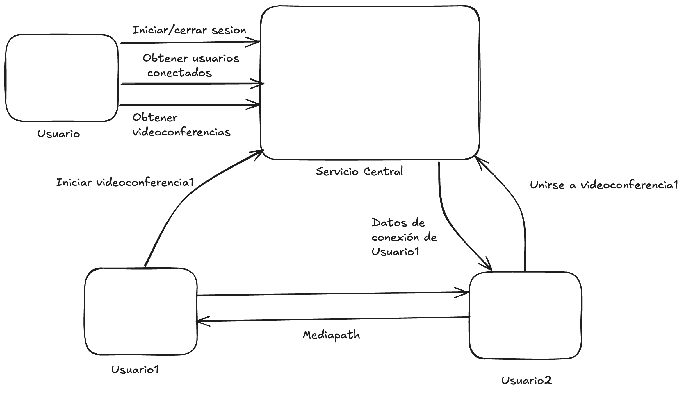

# Proyecto: RoomRTC - 2C 2025

## Introducción
Desde la pandemia de COVID-19 en 2020, el software para videoconferencias cobra una importancia central, ya que posibilitó la realización de clases, congresos y diversos eventos de manera remota.
Aun hoy, 5 años después, este tipo de sistemas sigue en vigencia.

En este contexto, la Universidad de Buenos Aires desea implementar un sistema de videoconferencias para transmitir cursos, congresos, etc.
Para que un software de este tipo sea considerado de calidad, se requiere que cumpla con ciertos requisitos tanto funcionales como no funcionales, como podrían ser: Usabilidad, escalabilidad, velocidad, bajo consumo de red, confiabilidad, seguridad, entre otros.

Tras analizar las diferentes alternativas existentes, tanto en software libre como alternativas privativas, se decide implementar una solución in-house.

La misma deberá contar con una implementación propia de [WebRTC](https://webrtc.org/?hl=es-419). Siendo esta una serie de protocolos que permiten la transmisión de video y sonido en tiempo real por parte de navegadores y aplicaciones móviles.
Debido a las necesidades de eficiencia y seguridad propias de este tipo de aplicaciones, el lenguaje de implementación será Rust.

## Objetivo del proyecto
El objetivo principal del presente Trabajo Práctico es desarrollar una versión en el lenguaje Rust del stack WebRTC, de manera tal que sea posible la realización de videoconferencias entre usuarios en distintos dispositivos. El proyecto debe respetar las specs (i.e., especificaciones), haciendo énfasis en la compatibilidad con clientes existentes de WebRTC.
Aspectos no funcionales como la escalabilidad y la eficiencia de la solución deben ser contemplados, ya que el proyecto debe poder ser utilizado por un gran número de personas, desde dispositivos de diversa potencia.

El objetivo secundario es desarrollar un proyecto real de software de mediana envergadura aplicando buenas prácticas de desarrollo, incluyendo entregas y revisiones periódicas. La idea es, después de todo, que este proyecto signifique no solo la aplicación de los temas vistos en la asignatura, sino que, del conjunto de conocimientos aprendidos durante la carrera hasta el momento.

## Requerimientos funcionales

Un sistema basado en WebRTC consta de diversos componentes, por lo que será necesaria una planificación y división adecuada del trabajo.

Entre esas componentes podemos encontrar:
- [SDP (Session Description Protocol)](https://www.rfc-editor.org/rfc/rfc4566): Utilizado para establecer la conexión entre pares.
- [ICE (Interactive Connectivity Establishment)](https://www.rfc-editor.org/rfc/rfc8445): Protocolo de comunicación utilizado entre pares para realizar la transmisión del video.
- Signaling Server: Encargado del discovery de peers. En este caso, el servicio central actuará de signaling server.
- Además, a la hora de transmitir video y sonido, se puede utilizar una variedad de códecs como [VP8](https://en.wikipedia.org/wiki/VP8) y [H264](https://en.wikipedia.org/wiki/Advanced_Video_Coding) que son los encontrados en la mayoría de implementaciones del protocolo. Pero a nivel de especificación, WebRTC no limita qué códec se debe utilizar, siempre y cuando ambas partes de la conexión se pongan de acuerdo.

#### Servicio central
Se deberá contar con un servidor central que actúe de signaling server y que además permita:
- Obtener el listado de usuarios conectados.
- Obtener información de conexión de un usuario conectado para iniciar una videoconferencia con él.

### Seguridad

Una vez establecida la conexión entre 2 pares, la misma deberá realizarse sobre [DTLS](https://es.wikipedia.org/wiki/Datagram_Transport_Layer_Security) para tener un canal de comunicación seguro.

### Aplicación cliente

Funcionalidades mínimas:
- Iniciar/cerrar sesión en la aplicación.
- Listar usuarios conectados, listos para iniciar una videoconferencia.
- Iniciar una videoconferencia con otro usuario conectado.
- Aceptar e ingresar a una videoconferencia iniciada por otro usuario.
- Salir de una sesión de videoconferencia.

### Flujo General

- Usuario1 se comunica con el servicio central para iniciar sesión.
- El servicio central almacena los datos de conexión de Usuario1.
- El servicio central muestra el listado de videoconferencias actuales.
- Usuario1 decide unirse a una de las videoconferencias (iniciada por Usuario2).
- El servicio central provee de los datos necesarios para conectarse a la misma (actuando de signaling server).
- Usuario1 se conecta directamente a Usuario2.
- Luego de establecida la conexión y posterior negociación de códecs, se inicia la transmisión.

## Requerimientos no funcionales
Los siguientes son los requerimientos no funcionales para la resolución del proyecto:

* El proyecto deberá ser desarrollado en lenguaje Rust, utilizando las herramientas de la biblioteca estándar.
* Se deben implementar pruebas unitarias y de integración de las funcionalidades que se consideren más importantes.
* El código fuente debe compilar en la versión estable del compilador y no se permite el uso de bloques inseguros (unsafe).
* El código deberá funcionar en ambiente Unix/Linux.
* La compilación no debe generar advertencias del compilador ni del linter Clippy.
* El programa no puede contener ningún [busy-wait](https://en.wikipedia.org/wiki/Busy_waiting), ni puede consumir recursos de CPU y/o memoria indiscriminadamente. Se debe hacer un uso adecuado tanto de la memoria como del CPU.
* Las funciones y los tipos de datos (struct) deben estar documentados siguiendo el estándar de cargo doc.
* El código debe formatearse utilizando cargo fmt.
* Las funciones no deben tener una extensión mayor a 30 líneas. Si se requiere una extensión mayor, se debe particionar en varias funciones.
* Cada tipo de dato implementado debe ser colocado en un módulo (archivo fuente) independiente.

## Crates externos permitidos
Se permite el uso de los siguientes crates solo para los usos mencionados (siempre y cuando se los considere necesarios):

* rand: para la generación de valores aleatorios.
* chrono: para la obtención del timestamp actual.
* Crates para DTLS.
* Crates para la captura y procesamiento de video (como [OpenCV](https://docs.rs/opencv/latest/opencv/) o [Nokhwa](git@github.com:l1npengtul/nokhwa.git)).
* Crates de códecs de media (VP8, H264, etc.).
* Crates para la implementación de la interfaz gráfica.

**Importante:** Cada crate externo que se desee utilizar para DLTS, captura y procesamiento de video e implementación de la interfaz gráfica deberá ser propuesto a los tutores, los cuales serán evaluados y autorizados por el grupo docente.

## Material de consulta

- [webrtc.org](https://webrtc.org/?hl=es-419) - Página oficial, contiene explicaciones tanto de alto nivel como detalles de implementación y de los diferentes componentes de WebRTC.
- [WebRTC for the curious](https://webrtcforthecurious.com/docs/01-what-why-and-how/): Sitio con explicaciones alternativas sobre cada componente de WebRTC.
- [WebRTC architecture](https://bharathkotha.medium.com/webrtc-architecture-the-webrtc-series-part-1-c1f21802ce32): Contiene bastantes diagramas arquitecturales de los componentes del protocolo.
— [What is ICE?](https://dyte.io/blog/webrtc-102-demystifying-ice/): Contiene diagramas y una buena explicación sobre ICE.
- [OpenCV tutorial](https://www.youtube.com/watch?v=zcfixnuJFXg&list=PLeku3Nthh5iGeb45RszvyZibdiwO4aZe2): video explicativo sobre cómo usar OpenCV desde Rust.

## Criterios de Aceptación y Corrección del Proyecto
Para el desarrollo del proyecto, se deberán observar los siguientes lineamientos generales:
1. **Testing:** Se deberá implementar testing unitario automatizado, utilizando las herramientas de Rust de los métodos y funciones relevantes implementados. Se deberán implementar tests de integración automatizados.
2. **Manejo de errores:** Deberá hacerse un buen uso y administración de los casos de error, utilizando para ello las estructuras y herramientas del lenguaje, escribiendo en forma lo más idiomática posible su tratamiento.
3. **Control de versiones:** Se deberá utilizar la herramienta git, siguiendo las recomendaciones de la cátedra. En particular, se deberá utilizar la metodología GitHub Flow para el trabajo con ramas (branches) y la entrega continua del software.
4. **Trabajo en equipo:** Se deberá adecuar, organizar y coordinar el trabajo del equipo, realizando tareas como revisión de código cruzada entre pares de una funcionalidad en un pull request de git.
5. **Merge de branches:** Para poder hacer el merge de un branch de una funcionalidad, todos los tests pasan de forma satisfactoria.
6. **Informe final:** El trabajo debe acompañarse por un informe que debe incluir diagramas de secuencia de las operaciones más relevantes, diagrama de componentes y módulos de la arquitectura general del diseño desarrollado, todos acompañados de la explicación respectiva.

## Evaluación
El desarrollo del proyecto tendrá un seguimiento directo semanal por parte del docente a cargo del grupo.

Se deberá desarrollar y presentar los avances y progreso del trabajo semana a semana (simulando un sprint de trabajo). Cada semana, cada docente realizará una valoración del estado del trabajo del grupo.

El progreso de cada semana deberá ser acorde a lo que se convenga con el docente para cada sprint. Si el mismo NO cumple con la cantidad de trabajo requerido, el grupo podrá estar desaprobado de forma prematura de la materia, a consideración del docente.

Hacia la mitad del desarrollo del proyecto se deberá entregar una versión preliminar que deberá cumplir con los requisitos mencionados en el apartado *Entrega intermedia*. Estos requisitos **son de cumplimiento mínimo y obligatorio**; aquellos grupos que lo deseen podrán implementar requisitos adicionales.

**Nota importante:** Se deja constancia de que las funcionalidades requeridas por este enunciado son un marco de cumplimiento mínimo y que puede haber agregados o modificaciones durante el transcurso del desarrollo por parte del docente a cargo, que formarán parte de los requerimientos a cumplir. Cabe mencionar que estos desvíos de los requerimientos iniciales se presentan en situaciones reales de trabajo con clientes.

## Finalización del proyecto
El desarrollo del proyecto finaliza el último día de clases del cuatrimestre. En esa fecha, cada grupo deberá realizar una presentación final y se hará una evaluación global del trabajo.

En dicha presentación se deberá detallar la arquitectura del proyecto, aprendizajes del mismo, y realizar una muestra funcional del desarrollo; esto es una "demo" como si fuera para el usuario final, donde se pueda observar todas las funcionalidades pedidas por el presente enunciado.

Durante la demostración en vivo, se debe poder observar tanto los requerimientos funcionales solicitados en el presente enunciado, como así también los requerimientos no funcionales.

El trabajo debe acompañarse por un informe que debe constar de los puntos detallados a continuación: explicación general de la investigación realizada y sus conclusiones, reglas de negocio de la solución y decisiones tomadas durante el desarrollo del proyecto, diagramas de secuencia de las operaciones más relevantes, diagrama de componentes y módulos de la arquitectura general del diseño desarrollado, todos acompañados de la explicación respectiva.

### Entrega intermedia:
Los alumnos deberán realizar una entrega intermedia, la cual deberá incluir los siguientes puntos del apartado de requerimientos funcionales:

#### Protocolo WebRTC
- Se deberá contar con la implementación de los componentes principales de WebRTC y los protocolos necesarios para poder realizar una conexión entre pares de manera local (sin servicio central).

#### Aplicación cliente
Deberá contar con una interfaz sencilla para realizar videoconferencias de manera directa entre dos usuarios.

#### Presentación
La entrega se realizará en forma de presentación, en la cual los alumnos deberán abarcar los siguientes puntos:

* Explicación general del desarrollo realizado, incluyendo diagramas de componentes y de secuencia de las funcionalidades más importantes.
* Diseño de la solución a implementar para completar el proyecto, incluyendo diagramas y su explicación.
* Recorrido por los módulos del código fuente escrito, explicando los principales contenidos.
* Demo en vivo de la aplicación gráfica, donde se pueda constatar que se pueden realizar videoconferencias entre distintas computadoras.

Todos los miembros del grupo deberán participar de la demo y explicar su participación en el proyecto, incluyendo detalles de implementación.

## Fechas de entrega
Entrega intermedia: 03/11

Entrega final de la cursada: 01/12

**Estas entregas serán presenciales en la sede de la Facultad.**
