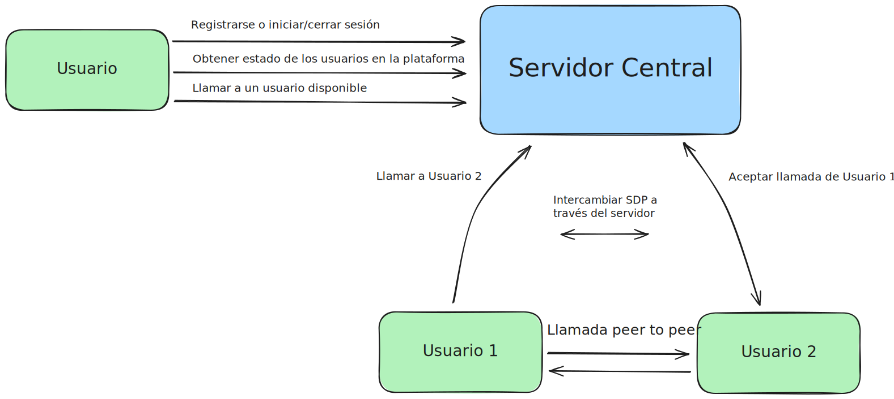

# Proyecto: RoomRTC - 2C 2025

## Introducción

Desde la pandemia de COVID-19 en 2020, el software para videoconferencias cobra una importancia central, ya que posibilitó la realización de clases, congresos y diversos eventos de manera remota.
Aun hoy, 5 años después, este tipo de sistemas sigue en vigencia.

En este contexto, la Universidad de Buenos Aires desea implementar un sistema de videoconferencias para transmitir cursos, congresos, etc.
Para que un software de este tipo sea considerado de calidad, se requiere que cumpla con ciertos requisitos tanto funcionales como no funcionales, como podrían ser: Usabilidad, escalabilidad, velocidad, bajo consumo de red, confiabilidad, seguridad, entre otros.

Tras analizar las diferentes alternativas existentes, tanto en software libre como alternativas privativas, se decide implementar una solución in-house.

La misma deberá contar con una implementación propia de [WebRTC](https://webrtc.org/?hl=es-419). Siendo esta una serie de protocolos que permiten la transmisión de video y sonido en tiempo real por parte de navegadores y aplicaciones móviles.
Debido a las necesidades de eficiencia y seguridad propias de este tipo de aplicaciones, el lenguaje de implementación será Rust.

## Objetivo del proyecto

El objetivo principal del presente Trabajo Práctico es desarrollar una versión en el lenguaje Rust del stack WebRTC, de manera tal que sea posible la realización de videoconferencias entre usuarios en distintos dispositivos. El proyecto debe respetar las specs (i.e., especificaciones), haciendo énfasis en la compatibilidad con clientes existentes de WebRTC.
Aspectos no funcionales como la escalabilidad y la eficiencia de la solución deben ser contemplados, ya que el proyecto debe poder ser utilizado por un gran número de personas, desde dispositivos de diversa potencia.

El objetivo secundario es desarrollar un proyecto real de software de mediana envergadura aplicando buenas prácticas de desarrollo, incluyendo entregas y revisiones periódicas. La idea es, después de todo, que este proyecto signifique no solo la aplicación de los temas vistos en la asignatura, sino que, del conjunto de conocimientos aprendidos durante la carrera hasta el momento.

## Requerimientos funcionales

Un sistema basado en WebRTC consta de diversos componentes, por lo que será necesaria una planificación y división adecuada del trabajo.

Entre esas componentes podemos encontrar:

- [SDP (Session Description Protocol)](https://www.rfc-editor.org/rfc/rfc4566): Utilizado para establecer la conexión entre pares.
- [ICE (Interactive Connectivity Establishment)](https://www.rfc-editor.org/rfc/rfc8445): Protocolo de comunicación utilizado para definir la ruta por la que se enviará el video.
  - Se debe soportar direcciones del tipo **Host** y **Server reflexive (STUN)**. Para STUN se puede utilizar un servidor de público.
- [RTP(real-time transport protocol) y RTCP(RTP control protocol)](https://datatracker.ietf.org/doc/html/rfc3550): Protocolo para realizar la transmisión de video.
- Signaling Server: Encargado del discovery de peers. En este caso, el servidor central actuará de signaling server.
- Además, a la hora de transmitir video y sonido, se puede utilizar una variedad de códecs como [VP8](https://en.wikipedia.org/wiki/VP8) y [H264](https://en.wikipedia.org/wiki/Advanced_Video_Coding) que son los encontrados en la mayoría de implementaciones del protocolo. Pero a nivel de especificación, WebRTC no limita qué códec se debe utilizar, siempre y cuando ambas partes de la conexión se pongan de acuerdo.

### Servidor central

Se deberá contar con un servidor central que actúe de signaling server y que cumpla con las siguientes características:

- Manejo de usuarios
  - Persistir en un archivo en texto plano a los usuarios de la plataforma junto con su contraseña y cualquier información que consideren relevante. No es necesario que esté encriptado.
  - Un usuario se debe poder registrar.
  - Un usuario debe poder hacer un log in en la plataforma.
  - El mismo usuario no puede estar conectado dos veces en la plataforma.
- Obtener el listado de usuarios y sus estados.
  - Los usuarios pueden estar en uno de tres estados.
    - **Desconectado**: El usuario está presente en la plataforma, pero no está conectado.
    - **Disponible**: El usuario está conectado y está disponible para hacer una llamada.
    - **Ocupado**: El usuario está actualmente en una llamada.
- Se debe poder llamar a un usuario disponible.
- Se deben poder soportar múltiples llamadas concurrentes entre distintos usuarios.
- Se debe poder limitar la cantidad de clientes simultaneos que pueden estar conectados a la aplicación.

#### Conexión con el servidor

La manera en la que los usuarios se van a comunicar con el servidor central va a ser a través de una conexión TCP encriptada con [TLS](https://en.wikipedia.org/wiki/Transport_Layer_Security) o encriptando los mensajes ustedes mismos.

El protocolo a utilizar dentro de esta conexión debe ser definido por ustedes y estar completamente documentado, así como debe ser capaz de cumplir con todos los requerimientos de la plataforma.

La conexión entre el servidor y los usuarios debe ser persistente, por lo que mientras el programa esté activo debería tener una conexión viva con el servidor, de manera de que este le pueda enviar a los usuarios actualizaciones **instantaneas** acerca del estado de los usuarios conectados, así como también notificarte cuando un usuario te está ofreciendo hacer una llamada.

### Seguridad

Una vez establecida la conexión entre 2 pares, la misma deberá realizarse sobre [SRTP](https://datatracker.ietf.org/doc/html/rfc3711), la cual se inicializa con [DTLS](https://es.wikipedia.org/wiki/Datagram_Transport_Layer_Security), para tener un canal de comunicación seguro.

### Aplicación cliente

Funcionalidades mínimas:

- Registrarse e iniciar/cerrar sesión en la aplicación.
- Pedir usuarios de la plataforma con sus estados.
- Llamar a otro usuario que esté disponible.
- Aceptar una llamada propuesta por otro usuario.
- Salir de una llamada.

### Flujo General

- Usuario2 se comunica con el servicio central para iniciar sesión.
- El servidor central cambia el estado del Usuario2 en la plataforma a disponible.
- El servicio central muestra el listado de usuarios con sus estados y la aplicación lo muestra en el "lobby".
- Usuario1 ve que Usuario2 está disponible. Decide llamarlo.
- Usuario2 tiene la opción de aceptar o declinar la llamada.
  - Si se declina la llamada entonces se le notifica al Usuario1 y no pasa nada.
  - Si se acepta la llamada se sigue con el flujo.
- Una vez aceptada la llamada, los usuarios intercambian oferta y respuesta SDP en el servidor.
- A partir de este punto, los usuarios aparecen como ocupados en la plataforma, pero siguen conectados al servidor. Pasan a hacer la llamada peer to peer, pasando a la siguiente etapa.
- Si alguno de los usuarios termina la llamada, ambos vuelven al lobby y aparecen como disponibles de nuevo.

### Transmisión de video

La transmisión de video se realiza a través de [RTP y RTCP](https://datatracker.ietf.org/doc/html/rfc3550).

Los paquetes que se tienen que implementar de RTCP son el paquete de bye y los sender y receiver reports. Se tienen que mostrar los valores que se manejan con los reportes en algún lugar de la UI mientras se van actualizando.

La transmisión de video tiene que cumplir con los siguientes requerimientos:

- La calidad esperada de video es 30fps, 720p.
- En el flujo de captura, transmisión y recepción de video, se espera que se **paralelicen** tareas para mayor eficiencia. Se pueden por ejemplo tener hilos para decodificar, codificar, empaquetar, etc. El diseño de una solución eficiente se evaluará en las entregas, por lo que lo tendrán que detallar en sus informes y presentar en las entregas.
- Se tienen que manejar la perdida y el desordenamiento de paquetes, sin delegárselo completamente a crates como openh264. La comunicación es en tiempo real, por lo que hay algunas cosas como pedir paquetes que se perdieron que no es necesario hacer, pero hay que notar cuando llegan en desorden, y descartar los que llegan muy tarde / no llegan. Tienen que tener en cuenta casos borde y explicarlos en sus informes así como presentaciones. Se espera que entiendan completamente el flujo de codificación y decodificación de video que eligieron y que manejen caminos no felices.
- Tener un [jitter buffer](https://en.wikipedia.org/wiki/Jitter#Jitter_buffers) para mitigar las fluctuaciones de la red. Tener en cuenta los timestamps de los frames para saber cuando mostrarlos, no simplemente mostrar cada frame apenas te llega.

### Archivo de configuración

Cada componente deber poder ser configurado mediante un archivo de configuración, de extensión `.conf` y cuya ubicación se pasara por argumento de línea de comando: `$ ./room-rtc /path/to/file.conf`. Todos los valores de configuracion mencionados en este enunciado y cualquier otro parametro necesario para la ejecucion del programa debera estar definido en este archivo. No se permite definir valores hardcodeados en el codigo fuente, ya sean direcciones IP, puertos o cualquier otra informacion necesaria.

### Logs

Cada componente deberá mantener un registro de las acciones realizadas y los eventos ocurridos en un archivo de log. La ubicación del archivo de log estará especificada en el archivo de configuración. Como requerimiento particular del Proyecto, NO se considerará válido que el servidor mantenga un file handle global, aunque esté protegido por un lock, y que se escriba directamente al file handle.

Es muy importante que al elegir lo que se va a loguear, se tenga en cuenta que en las entregas muchas veces los logs serán la única forma en la que sabremos lo que sucede en nuestro programa, por lo que tienen que ser claros y mostrar al docente que las cosas funcionan.

## Requerimientos no funcionales

Los siguientes son los requerimientos no funcionales para la resolución del proyecto:

* El proyecto deberá ser desarrollado en lenguaje Rust, utilizando las herramientas de la biblioteca estándar.
* Se deben implementar pruebas unitarias y de integración de las funcionalidades que se consideren más importantes.
* El código fuente debe compilar en la versión estable del compilador y no se permite el uso de bloques inseguros (unsafe).
* El código deberá funcionar en ambiente Unix/Linux.
* La compilación no debe generar advertencias del compilador ni del linter Clippy.
* El programa no puede contener ningún [busy-wait](https://en.wikipedia.org/wiki/Busy_waiting), ni puede consumir recursos de CPU y/o memoria indiscriminadamente. Se debe hacer un uso adecuado tanto de la memoria como del CPU.
* Las funciones y los tipos de datos (struct) deben estar documentados siguiendo el estándar de cargo doc.
* El código debe formatearse utilizando cargo fmt.
* Las funciones no deben tener una extensión mayor a 30 líneas. Si se requiere una extensión mayor, se debe particionar en varias funciones.
* Cada tipo de dato implementado debe ser colocado en un módulo (archivo fuente) independiente.

## Crates externos permitidos
Se permite el uso de los siguientes crates solo para los usos mencionados (siempre y cuando se los considere necesarios):

* rand: para la generación de valores aleatorios.
* chrono: para la obtención del timestamp actual.
* Crates para DTLS.
* Crates para la captura y procesamiento de video (como [OpenCV](https://docs.rs/opencv/latest/opencv/) o [Nokhwa](https://github.com/l1npengtul/nokhwa).
* Crates de códecs de media (VP8, H264, etc.).
* Crates para la implementación de la interfaz gráfica.

**Importante:** Cada crate externo que se desee utilizar para DLTS, captura y procesamiento de video e implementación de la interfaz gráfica deberá ser propuesto a los tutores, los cuales serán evaluados y autorizados por el grupo docente.

## Material de consulta

- [webrtc.org](https://webrtc.org/?hl=es-419) - Página oficial, contiene explicaciones tanto de alto nivel como detalles de implementación y de los diferentes componentes de WebRTC.
- [WebRTC for the curious](https://webrtcforthecurious.com/docs/01-what-why-and-how/): Sitio con explicaciones alternativas sobre cada componente de WebRTC.
- [WebRTC architecture](https://bharathkotha.medium.com/webrtc-architecture-the-webrtc-series-part-1-c1f21802ce32): Contiene bastantes diagramas arquitecturales de los componentes del protocolo.
— [What is ICE?](https://dyte.io/blog/webrtc-102-demystifying-ice/): Contiene diagramas y una buena explicación sobre ICE.
- [OpenCV tutorial](https://www.youtube.com/watch?v=zcfixnuJFXg&list=PLeku3Nthh5iGeb45RszvyZibdiwO4aZe2): video explicativo sobre cómo usar OpenCV desde Rust.

## Criterios de Aceptación y Corrección del Proyecto
Para el desarrollo del proyecto, se deberán observar los siguientes lineamientos generales:
1. **Testing:** Se deberá implementar testing unitario automatizado, utilizando las herramientas de Rust de los métodos y funciones relevantes implementados. Se deberán implementar tests de integración automatizados.
2. **Manejo de errores:** Deberá hacerse un buen uso y administración de los casos de error, utilizando para ello las estructuras y herramientas del lenguaje, escribiendo en forma lo más idiomática posible su tratamiento.
3. **Control de versiones:** Se deberá utilizar la herramienta git, siguiendo las recomendaciones de la cátedra. En particular, se deberá utilizar la metodología GitHub Flow para el trabajo con ramas (branches) y la entrega continua del software.
4. **Trabajo en equipo:** Se deberá adecuar, organizar y coordinar el trabajo del equipo, realizando tareas como revisión de código cruzada entre pares de una funcionalidad en un pull request de git.
5. **Merge de branches:** Para poder hacer el merge de un branch de una funcionalidad, todos los tests pasan de forma satisfactoria.
6. **Informe final:** El trabajo debe acompañarse por un informe que debe incluir diagramas de secuencia de las operaciones más relevantes, diagrama de componentes y módulos de la arquitectura general del diseño desarrollado, todos acompañados de la explicación respectiva.

## Evaluación
El desarrollo del proyecto tendrá un seguimiento directo semanal por parte del docente a cargo del grupo.

Se deberá desarrollar y presentar los avances y progreso del trabajo semana a semana (simulando un sprint de trabajo). Cada semana, cada docente realizará una valoración del estado del trabajo del grupo.

El progreso de cada semana deberá ser acorde a lo que se convenga con el docente para cada sprint. Si el mismo NO cumple con la cantidad de trabajo requerido, el grupo podrá estar desaprobado de forma prematura de la materia, a consideración del docente.

Hacia la mitad del desarrollo del proyecto se deberá entregar una versión preliminar que deberá cumplir con los requisitos mencionados en el apartado *Entrega intermedia*. Estos requisitos **son de cumplimiento mínimo y obligatorio**; aquellos grupos que lo deseen podrán implementar requisitos adicionales.

**Nota importante:** Se deja constancia de que las funcionalidades requeridas por este enunciado son un marco de cumplimiento mínimo y que puede haber agregados o modificaciones durante el transcurso del desarrollo por parte del docente a cargo, que formarán parte de los requerimientos a cumplir. Cabe mencionar que estos desvíos de los requerimientos iniciales se presentan en situaciones reales de trabajo con clientes.

## Finalización del proyecto
El desarrollo del proyecto finaliza el último día de clases del cuatrimestre. En esa fecha, cada grupo deberá realizar una presentación final y se hará una evaluación global del trabajo.

En dicha presentación se deberá detallar la arquitectura del proyecto, aprendizajes del mismo, y realizar una muestra funcional del desarrollo; esto es una "demo" como si fuera para el usuario final, donde se pueda observar todas las funcionalidades pedidas por el presente enunciado.

Durante la demostración en vivo, se debe poder observar tanto los requerimientos funcionales solicitados en el presente enunciado, como así también los requerimientos no funcionales.

El trabajo debe acompañarse por un informe que debe constar de los puntos detallados a continuación: explicación general de la investigación realizada y sus conclusiones, reglas de negocio de la solución y decisiones tomadas durante el desarrollo del proyecto, diagramas de secuencia de las operaciones más relevantes, diagrama de componentes y módulos de la arquitectura general del diseño desarrollado, todos acompañados de la explicación respectiva.

### Entrega intermedia:
Los alumnos deberán realizar una entrega intermedia, la cual deberá incluir los siguientes puntos del apartado de requerimientos funcionales:

#### SDP

Se deberá contar con la implementación de las estructuras de datos y los métodos necesarios para poder generar y parsear archivos SDP.

#### ICE

Los clientes deberán poder realizar la selección de candidatos y los connectivity checks para elegir la mejor ruta de comunicación entre pares siguiendo el protocolo de ICE.

Para esta entrega los candidatos pueden ser solo locales.

#### RTP y RTCP

Se deberá contar con la implementación de los protocolos RTP y RTCP para la transmisión de **video** entre pares.

Para esta instancia todavía no será necesario tener encriptación (DTLS, SRTP)

#### Aplicación cliente

Deberá contar con una interfaz sencilla para realizar videoconferencias de manera directa entre dos usuarios.

Además, como en esta etapa **no va a ser obligatorio contar con signaling server**, la idea es que puedan pedir a un usuario A que genere un SDP offer desde la interfaz, insertarlo en el usuario B para que genere un SDP answer, y luego insertarlo en el usuario A para que se pueda iniciar la transmisión de video.

#### Presentación
La entrega se realizará en forma de presentación, en la cual los alumnos deberán abarcar los siguientes puntos:

* Explicación general del desarrollo realizado, incluyendo diagramas de componentes y de secuencia de las funcionalidades más importantes.
* Diseño de la solución a implementar para completar el proyecto, incluyendo diagramas y su explicación.
* Recorrido por los módulos del código fuente escrito, explicando los principales contenidos.
* Demo en vivo de la aplicación gráfica, donde se pueda constatar que se pueden realizar videoconferencias entre distintas computadoras.

Todos los miembros del grupo deberán participar de la demo y explicar su participación en el proyecto, incluyendo detalles de implementación.

## Fechas de entrega
Entrega intermedia: 03/11

Entrega final de la cursada: 01/12

**Estas entregas serán presenciales en la sede de la Facultad.**
