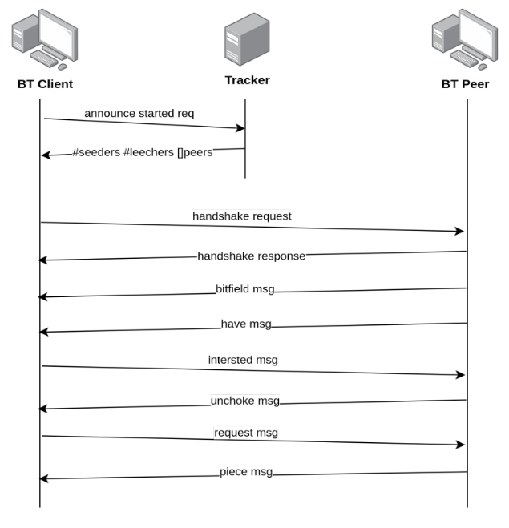

# Proyecto: BitTorrent - 1er Cuatrimestre 2022

[**Descargar enunciado en PDF**](./Proyecto_2022_1C_BitTorrent.pdf)

## Introducción

BitTorrent es un protocolo de capa de aplicación de arquitectura P2P que se utiliza para transferencia de archivos entre múltiples dispositivos que se denominan peers. Debido a su arquitectura, BitTorrent es un protocolo escalable ya que no tiene un único punto de falla, más bien todos los peers garantizan la transferencia de un archivo de un nodo de la red a otro. Se denomina torrent al conjunto de peers que participan en la distribución de un archivo en particular.

Para transferir un archivo a este se lo separa en chunks de igual tamaño y varios peers pueden transferir varios chunks de manera simultánea. Cuando un peer se suma a un torrent, inicialmente no tiene el archivo, e irá progresivamente recibiendo chunks hasta tenerlo por completo.

La documentación oficial del proyecto BitTorrent se encuentra en: https://www.bittorrent.org/.

## Objetivo del Proyecto

El objetivo del proyecto es implementar un **Cliente BitTorrent** con funcionalidades acotadas, que se detallan en el presente enunciado.

El objetivo secundario del proyecto consiste en el desarrollo de un proyecto real de software de mediana envergadura aplicando buenas prácticas de desarrollo de software, incluyendo entregas y revisiones usando un sistema de control de versiones.

Se espera que se haga un uso lo más idiomático posible del lenguaje de programación, siguiendo los estándares que éste promueve.

## Criterios de Aceptación y Corrección del Proyecto

Para el desarrollo del proyecto, se deberá observar los siguientes lineamientos generales:

1. **[Testing]** Se deberá implementar testing unitario automatizado, utilizando las herramientas de Rust de los métodos y funciones relevantes implementados.
   Se deberán implementar tests de integración automatizados.
2. **[Manejo de Errores]** Deberá hacerse un buen uso y administración de los casos de error, utilizando para ello, las estructuras y herramientas del lenguaje, escribiendo en forma lo más idiomática posible su tratamiento.
3. **[Control de versiones]** Se deberá utilizar la herramienta git, siguiendo las recomendaciones de la cátedra. En particular, se deberá utilizar la metodología GitHub Flow para el trabajo con ramas (branches) y la entrega continua del software.
4. **[Trabajo en equipo]** Se deberá adecuar, organizar y coordinar el trabajo al equipo, realizando tareas como revisión de código cruzada entre pares de una funcionalidad en un pull request de git.
5. **[Merge de Branchs]** Para poder hacer el merge de un branch de una funcionalidad, todos los tests pasan de forma satisfactoria.

## Evaluaciones

El desarrollo del proyecto tendrá un seguimiento directo semanal por parte del docente a cargo del grupo.

Se deberá desarrollar y presentar los avances y progreso del trabajo semana a semana (simulando un sprint de trabajo). Cada semana, cada docente realizará una valoración del estado del trabajo del grupo.

El progreso de cada semana deberá ser acorde a lo que se convenga con el docente para cada sprint. Si el mismo NO cumple con la cantidad de trabajo requerido, el grupo podrá estar desaprobado de forma prematura de la materia, a consideración del docente.

Hacia la mitad del desarrollo del proyecto se deberá entregar una versión preliminar que deberá cumplir con un conjunto de requisitos a definir por la cátedra en las próximas semanas. Dichos requisitos serán de cumplimiento mínimo y obligatorio, aquellos grupos que lo deseen podrán implementar requisitos adicionales.

**Nota importante:** Se deja constancia que las funcionalidades requeridas por este enunciado son un marco de cumplimiento mínimo y que pueden haber agregados o modificaciones durante el transcurso del desarrollo por parte del docente a cargo, que formarán parte de los requerimientos a cumplir. Cabe mencionar que estos desvíos de los requerimientos iniciales se presentan en situaciones reales de trabajo con clientes.

## Finalización del Proyecto

El desarrollo del proyecto finaliza el último día de clases del cuatrimestre. En esa fecha, cada grupo deberá realizar una presentación final y se hará una evaluación global del trabajo.

En dicha presentación se deberá detallar la arquitectura del proyecto, aprendizajes del mismo, y realizar una muestra funcional del desarrollo, esto es una "demo" como si fuera para el usuario final.

El trabajo debe acompañarse por un informe que debe constar de los puntos detallados precedentemente, diagramas de secuencia de las operaciones más relevantes, diagrama de componentes y módulos de la arquitectura general del diseño desarrollado, todos acompañados de la explicación respectiva.

## Requerimientos no funcionales

Los siguientes son los requerimientos no funcionales para la resolución del proyecto:

- El proyecto deberá ser desarrollado en lenguaje Rust, usando las herramientas de la biblioteca estándar.
- Se deben implementar **tests unitarios** y **de integración** de las funcionalidades que se consideren más importantes.
- No se permite utilizar **crates** externos. El único crate autorizado a ser utilizado es [rand](https://crates.io/crates/rand) en caso de que se quiera generar valores aleatorios.
- El código fuente debe compilarse en la versión stable del compilador y no se permite utilizar bloques unsafe.
- El código deberá funcionar en ambiente Unix / Linux.
- El programa deberá ejecutarse en la línea de comandos.
- La compilación no debe arrojar **warnings** del compilador, ni del linter **clippy**.
- Las funciones y los tipos de datos (**struct**) deben estar documentadas siguiendo el estándar de **cargo doc**.
- El código debe formatearse utilizando **cargo fmt**.
- Las funciones no deben tener una extensión mayor a 30 líneas. Si se requiriera una extensión mayor, se deberá particionarla en varias funciones.
- Cada tipo de dato implementado debe ser colocado en una unidad de compilación (archivo fuente) independiente.

## Requerimientos funcionales

Los siguientes son los requerimientos funcionales para el desarrollo del Trabajo.

El cliente de BitTorrent deberá permitir descargar más de un archivo por vez en una misma ejecución. Todos los archivos torrent deseados se deberán suministrar como parámetro al momento de la ejecución del programa. Se puede optar por suministrar la ruta a un directorio (en lugar de un archivo) como parámetro, de forma que se deberá leer todos los archivos torrent existentes en el mismo.

Como mínimo, se debe soportar la posibilidad de archivos torrent de tipo [single-file](https://wiki.theory.org/BitTorrentSpecification#Info_in_Single_File_Mode) (es decir, conteniendo un único archivo). Se espera y es deseable que sea implementada la funcionalidad que sea capaz de descargar torrent que contengan múltiples archivos.

### Protocolo

El protocolo a implementar corresponde a la versión 1.0, cuya especificacion oficial se encuentra en: http://bittorrent.org/beps/bep_0003.html

Sin embargo, dado que la misma carece de detalles de implementación, utilizaremos la siguiente especificación no oficial para obtener mayor nivel de detalle: https://wiki.theory.org/BitTorrentSpecification

A continuación se muestra un ejemplo de comunicación entre el **cliente (BT client)**, el **tracker** y uno de los **peers (BT peer)**:

### Funcionalidades del cliente

#### Configuración

El cliente BitTorrent debe poder ser configurado mediante un archivo de configuración.

Las opciones de configuración mínimas son:

- puerto TCP en el que se reciben conexiones de otros peers.
- ruta al directorio de logs.
- ruta al directorio de descargas de archivos.

#### Arquitectura

Se debe implementar la arquitectura de tipo cliente / servidor para el correcto funcionamiento de las descargas de archivos y la transmisión a terceras partes desde el mismo cliente como fuente emisora (_seed_), en este actúa como servidor.

#### Logs

El cliente BitTorrent debe mantener un registro de las acciones realizadas y los eventos ocurridos en un archivo de log. Se debe escribir en el log cada vez que se complete una pieza de uno de los archivos descargados.

La ubicación del archivo de log estará especificada en el archivo de configuración.
Como requerimiento particular del Proyecto, NO se considerará válido que el servidor mantenga un _file handle global_, aunque esté protegido por un lock, y que se escriba directamente al file handle. La arquitectura deberá contemplar otra solución.

### Almacenamiento de la descarga

Cada grupo puede optar en su solución por la estrategia de almacenamiento del archivo descargado tal como lo desee. Una estrategia consiste en reservar y escribir de forma inicial en el disco la totalidad del tamaño de los archivos que componen al torrent y luego sobre-escribir cada byte con el correspondiente al archivo a medida que se descarga. La otra opción consiste en coleccionar todas las piezas del archivo que se descarga (o de los múltiples archivos que componen al torrent) en un almacenamiento temporal y realizar un ensamblado al finalizar la descarga.

### Procesamiento del archivo .torrent

El archivo .torrent contiene la metadata esencial para el funcionamiento de la descarga por BitTorrent. Se representa con un diccionario codificado con el formato [Bencoding](https://wiki.theory.org/BitTorrentSpecification#Bencoding) que contiene toda la información referida al torrent.

Para este trabajo nos centraremos principalmente en las claves announce e info, las cuales contienen la URL del Tracker y la información del contenido de la descarga, ya sea un único archivo o múltiples archivos y directorios. Para más detalles consultar la [especificación](https://wiki.theory.org/BitTorrentSpecification#Metainfo_File_Structure).

### Comunicación con el Tracker

La comunicación con el Tracker se realiza a través del protocolo HTTP, enviando los parámetros por querystring. La respuesta se encuentra codificada con el formato [Bencoding](https://wiki.theory.org/BitTorrentSpecification#Bencoding).

A continuación se detalla la información a enviar en el request y los valores de respuesta:

#### Tracker Request

Se realiza mediante un request HTTP GET a la url de **announce** especificada en el archivo .torrent, enviando los siguiente parámetros por querystring:

- `info_hash`: Valor de 20 bytes resultante de aplicar el algoritmo SHA-1 al valor info del archivo .torrent, encodeado con urlencode.
- `peer_id`: Cadena de 20 bytes utilizada como identificador único del cliente encodeada con urlencode.
- `port`: Número de puerto en el cual el cliente escucha conexiones.
- `ip`: Opcional. Dirección IP del cliente.
- `uploaded`: Número que indica la cantidad de bytes subidos hasta el momento.
- `downloaded`: Número que indica la cantidad de bytes descargados hasta el momento.
- `left`: Número de bytes pendientes por descargar.
- `event`: Cadena de caracteres que indica el estado en el que se encuentra el cliente. Puede ser: started, completed o stopped.

#### Tracker Response

El tracker responde las peticiones con un diccionario tipo Bencoded con los siguientes datos:

- `interval`: Tiempo en segundos que el cliente tiene que esperar para mandar peticiones al tracker.
- `complete`: Número con que indica la cantidad de seeds.
- `incomplete`: Número con que indica la cantidad de leechers.
- `peers`: Lista de diccionarios con los siguientes valores: peer id, dirección IP y puerto.
  - `peer_id`: Cadena de 20 bytes utilizada como identificador único del cliente.
  - `ip`: Cadena de caracteres con la dirección IP o nombre de DNS del peer
  - `port`: Número entero con el puerto que escucha el peer.

### Mensajes P2P que se deberán soportar

A continuación se detalla el contenido y significado de cada tipo de mensaje indicando:
`<longitud del mensaje><tipo del mensaje>[<información útil>]`

- `keep alive`: `<0>` Se envía para mantener la conexión viva si ningún otro mensaje ha sido enviado durante 2 minutos.
- `choke`: `<1><0>` El emisor comunica al receptor que lo ha bloqueado, es decir, que no le servirá ninguna petición pendiente o futura.
- `unchoke`: `<1><1>` El emisor comunica al receptor que lo ha desbloqueado y que responderá a las peticiones.
- `interested`: `<1><2>` El emisor comunica al receptor que está interesado en alguna de sus piezas.
- `not interested`: `<1><3>` El emisor comunica al receptor que no está interesado en ninguna de sus piezas.
- `have`: `<5><4><índice de pieza>` El índice de pieza son 4 bytes en decimal. El emisor comunica al receptor que tiene una pieza determinada. Este mensaje lo envía el peer local a todos los peers conocidos cada vez que consigue descargar una pieza nueva.
- `bitfield`: `<1+X><5><bitfield>` El emisor envía al receptor una secuencia de bytes de tamaño X que representa un campo de bits indicando qué piezas tiene (bit a 1) y cuales no (bit a 0). Leyendo los bits de izquierda a derecha, el primer byte corresponde a las piezas 0-7, el segundo corresponde a las piezas 8-15. Los bits del final que no se usan se ponen a 0. Este es el primer mensaje que se envía en la conexión P2P. Los peers sin ninguna pieza pueden obviar el envío de este mensaje.
- `request`: `<13><6><índice de pieza><comienzo><longitud>` Cada uno de los tres campos que aparecen después del tipo del mensaje son 4 bytes en decimal. Estos campos describen un bloque que se encuentra en una pieza determinada, comienza en un byte dentro de ésta y tiene una determinada longitud. Este mensaje sirve para pedir un bloque al peer receptor.
- `piece`: `<9+X><7><índice de pieza><comienzo><bloque>` Cada uno de los dos primeros campos que aparecen después del tipo del mensaje son 4 bytes en decimal e indican la posición de un bloque dentro de una pieza. El tercer campo contiene el bloque, que es una secuencia de bytes de longitud X. Este mensaje sirve para enviar un bloque previamente solicitado por un peer remoto.
- `cancel`: `<13><8><índice de pieza><comienzo><longitud>` Cada uno de los tres campos que aparecen después del tipo del mensaje son 4 bytes en decimal y describen un bloque. Este mensaje normalmente se envía durante la fase End Game para cancelar peticiones duplicadas.

### Interfaz gráfica

La aplicación cliente deberá contar con una interfaz gráfica que permita conocer el estado de las descargas de los torrents en curso.

Para realizar dicha aplicación, se debe utilizar el crate GTK. El grupo deberá investigar cómo utilizar dicho crate.

#### Requerimientos

La interfaz gráfica deberá contar con la siguientes pestañas:

- **Pestaña de información general:** Esta pestaña deberá contar con la información general de los torrents en curso, incluyendo: nombre y metadata del torrent (hash de verificación, tamaño total, cantidad de piezas, cantidad de peers, etc), estructura de archivos del torrent (ya sea un single file o una estructura de archivos y directorios) además del estado general de la descarga (porcentaje de completitud, cantidad de piezas descargadas y verificadas) y la cantidad de conexiones activas correspondiente a cada torrent.
- **Pestaña de estadísticas de descarga:** Esta pestaña deberá contar con todas las estadísticas de las descargas en curso, incluyendo: lista de Peers con ID, IP y puerto de cada una de las conexiones activas, velocidad de bajada y subida de cada conexión, estado del Peer (choked/unchoked, interested/not interested) y estado del cliente en el Peer (choked/unchoked, interested/not interested)

**Aclaración importante:** El diseño de la interfaz y cómo se acomodan los componentes de la misma estará a cargo de cada grupo y será validada por los tutores asignados.
